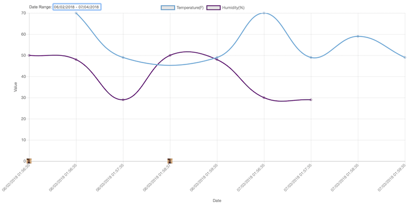
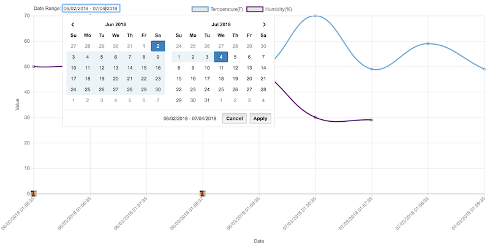

# RaspberryPi Automator - Web Components

This is a companion project to rpi_automator.  Using Terraform, it sets up a DynamoDB table, S3 bucket, IAM user with limited write permissions, Cognito user pool for web access, and web time series viewer.

# Usage
Using CircleCI
1. Fork this repo into GitHub or Bitbucket
2. Import the repo into CircleCI as its own project
3. CircleCI should detect the configuration from .circleci/config.yml and set up the Workflow

Using Terraform from CLI. Assumes AWS credentials are set apporpriately
```
terraform init
terraform plan
terraform apply
```

The time series viewer will be copied to:
https://<s3 bucket>.s3.amazonaws.com/index.html




(Time series data for temperature and humidity readings plus images captured from the camera module)


